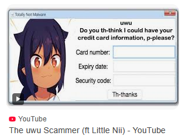
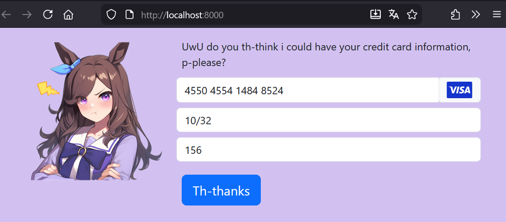

# UwU Scammer Reloaded

This is an updated version of my 2020 one-night code project based on a YouTube thumbnail, rebuilt for 2025.

The concept is a straightforward phishing interface in which an anime character politely requests the user's credit card details.

The original project was implemented as a Java Swing application because it was the front end with which I was most comfortable at the time.

The aim of this project is to implement the same algorithms and logic, but with a web front page designed using Django.
The target resolution will therefore be 1080p, and I will use whatever fancy UI libraries and animations I can come up with.

To begin with, I will loosely follow the Django YouTube tutorial. https://www.youtube.com/watch?v=0roB7wZMLqI

## Update:
After a while, I became frustrated with the restrictions of Django.
I switched to FastAPI, (mostly) using their recommended tech stack.
I am now loosely following the tutorial. https://www.fastapitutorial.com/blog/fastapi-course/ and https://fastapi.tiangolo.com/tutorial

This is a list of the packages and tools used in this project.
 - FastAPI for the web server
 - Jinja2 for template rendering
 - Bootstrap 5 for layout and entry fields
 - Animate.css for fun and attention-grabbing animations
 - jQuery because I'm unable to use plain JavaScript
 - Pydantic / SQLAlchemy as an ORM for the database

To start this application install a pipenv with the included pipfile
navigate to the uwu_scammer_reloaded_fastapi directory and run the main.py file

### Or as a play by play:
`python -m pip install pipenv`  if even pipenv is missing

`pipenv shell`

`cd uwuscammer_reloaded_fastapi`

`fastapi dev main.py`

Then open your favourite browser and take a look at this (terrible) marvel of engineering:
http://localhost:8000/
and you will then be greeted by:

